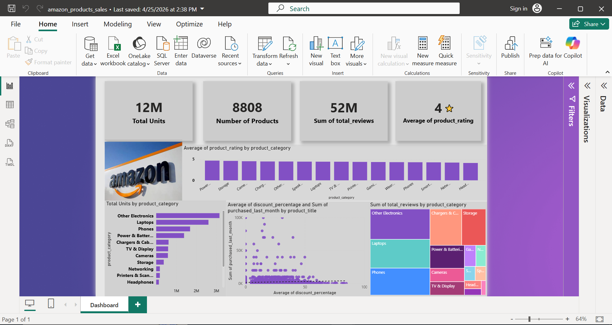

​📊 Project Insights & Business Recommendations
​After analyzing the dataset, I have identified several key strategic opportunities to optimize sales and marketing 
performance:

  

​1️⃣ Optimized Ad Spend Allocation
​Insight: High-performance categories like Laptops, Phones, and Other Electronics consistently generate millions in revenue.
​Recommendation: Marketing budgets should prioritize these "Core" categories to ensure a guaranteed Return on Ad Spend (ROAS), as they demonstrate the strongest market demand.
​2️⃣ Strategic Discounting Thresholds
​Insight: Data shows that the highest sales volume occurs when discounts are maintained between 10% and 40%.
​Observation: Sales actually decline when discounts exceed 70%—suggesting that excessive discounting may negatively impact "Perceived Quality" or brand trust.
​Recommendation: Implement a capped discounting strategy to maintain healthy profit margins without compromising brand value.
​3️⃣ Expanding Reach for Niche High-Quality Categories
​Insight: Categories like Smart Home and Wearables have exceptionally high customer ratings but low sales volume.
​Diagnosis: The issue is not product quality, but market penetration (Awareness).
​Strategy: Use "Product Bundling" by offering these high-rated items as deals with top-selling categories (e.g., Laptops/Electronics) to increase exposure and drive adoption.
